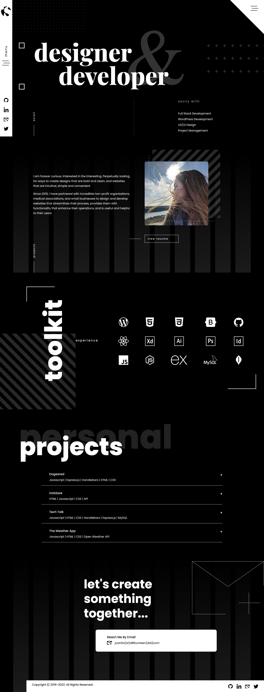

# Portfolio

This single page application, built in React, provides information about my skills, experience, and applications I have developed. 

## Table of Contents

  * [Description](#description)
  * [License](#license)
  * [Application Screenshots](#screenshots)
  * [Preview](#preview)
  * [Questions](#questions)

## Description

Prior to embarking on building my first React application, I laid out the design in Adobe XD. The portfolio provides future potential employers with an overview about myself, the tools I'm skilled with, and applications I have built, and various way on how to reach me. 

Using the Bootstrap framework and CSS, I implemented the design. There are a few custom elements I incorporated: offcanvas menu and accordion. 

The UI is clean, polished, and the User will be able to navigate the site with ease. I have also ensured that it is mobile responsive.

This application was built using the following:

* HTML & CSS
* Javascript
* React
* Bootstrap

## License

This application is covered under the MIT license.

## Application Screenshots

Preview screens of the application. 

#### PORTFOLIO

#### MOBILE VIEW

## Preview

GitHub Repo: https://github.com/jsamborski310/portfolio

GitHub Pages: https://jsamborski310.github.io/portfolio/

## Questions

For questions about this application or if you would like to collaborate, connect with me on <a href="https://www.linkedin.com/in/juanita-samborski/" target="_blank">Linkedin</a>.

